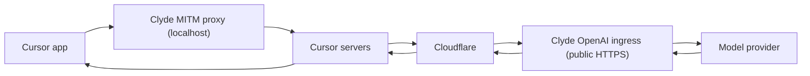

# Cursor

Cursor permits users to supply their own publicly accessible OpenAI compatible end point.
We can use this to route requests through native agent CLIs without needing to use a separate API key. 

## Background

Cursor reaches Clyde over two surfaces at the same time: 

- Clyde MITM: A transparent proxy that serves primarily to capture and inspect all network activity for agents. Cursor can be patched to have its proxy settings point at it (see: https://github.com/agoodkind/desktop-via-clyde)
- Clyde OpenAI-compatible ingress: Clyde’s system for translating OpenAI chat completion requests to and from the format expected by upstream subscription-based backends (currently: Codex and Anthropic)

## Cursor BYOK (bring your own key)
Cursor's BYOK speaks the OpenAI Chat Completions schema so we can make cursor actually route chat requests through Clyde ingress.

Cursor's own servers call this endpoint across the internet rather than the app reaching it directly, so it has to be publicly reachable through a tunnel, and a localhost or LAN address cannot work. 

This limitation can be worked around by using a Cloudflare tunnel to quickly stand up a public facing endpoint that dumps onto your local host.

## Combined request lifecycle

When you send a message, Cursor routes it out through its proxy setting to the local MITM proxy, on to Cursor’s own backend, through Cloudflare, and then into Clyde’s public ingress.

A single chat turn travels through **both** surfaces in this sequence:

To recap:
- Cursor MITM: passes through MITM directly via localhost
- Cursor BYOK: routed through Cursor’s servers which then in turn calls our Cloudflare tunnel which then finally passes it down to localhost 

## Error Boundary

Cursor shows a full BYOK error message when the status is a 4xx. 

On a 5xx or 429 it replaces that message with its own generic notice that lacks any details. This is particularly frustrating when debugging issues that result in a 5xx since they appear as “rate limited” when they really aren’t. 

The ingress therefore returns every upstream failure as an HTTP 400 carrying an `invalid_request_error` body, so the real reason reaches the chat.

An Anthropic rate limit, for instance, comes back as a 400 that reads "rate limit reached on the Anthropic OAuth bucket; try again shortly".

If you feel like this sounds counterintuitive then you aren’t alone. It’s a half baked design on Cursor’s part, so always returning 4xx allows users to debug robustly without 

- Cursor MITM specifics is covered in [Cursor BYOK MITM setup](cursor-mitm-setup.md)
- Cursor MITM PoC patching (along with other electron desktop clients) can be found at: https://github.com/agoodkind/desktop-via-clyde