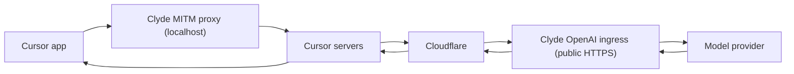

# Cursor

Cursor reaches Clyde over two surfaces at the same time, and the first thing to be clear about is where each one lives and what flows through it.

The MITM proxy listens on your machine at a local address. Cursor's proxy setting points at it, and Cursor's own IDE backend traffic, the requests it makes to Cursor's servers, flows through it. Clyde forwards and observes those bytes but leaves the exchange untouched.

The OpenAI-compatible ingress is a public HTTPS endpoint, not a local one. Cursor's BYOK speaks the OpenAI Chat Completions schema, and the ingress accepts and answers in that schema while translating to and from the upstream provider's native API in between. Cursor's own servers call this endpoint across the internet rather than the app reaching it directly, so it has to be publicly reachable through a tunnel, and a localhost or LAN address cannot work.

A single chat turn travels through both surfaces in sequence.

When you send a message, Cursor routes it out through its proxy setting to the local MITM proxy, on to Cursor's own backend, through Cloudflare, and into Clyde's public ingress. Clyde calls the model provider there and returns the reply back along the same path to the app. The turn leaves through the local MITM surface and re-enters through the public ingress surface, so the two surfaces handle the same request at different points and over different addresses.

Cursor shows the error message Clyde returns only when the status is a 4xx, and on a 5xx or 429 it replaces that message with its own generic notice. The ingress therefore returns every upstream failure as an HTTP 400 carrying an invalid_request_error body, so the real reason reaches the chat. An Anthropic rate limit, for instance, comes back as a 400 that reads "rate limit reached on the Anthropic OAuth bucket; try again shortly" instead of a blank retry toast.

Setup is covered in [Cursor BYOK MITM setup](cursor-mitm-setup.md), the shared request legs in [request paths](logging/request-paths.md), and how this traffic is captured in [payload policy](logging/payload-policy.md).
