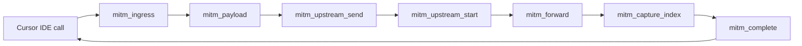

# Request Paths

Every request path uses one stable request story and a required leg sequence.

## Adapter chat

```mermaid
flowchart LR
  cursorChat["Cursor chat"] --> adapterIngress["adapter_ingress"]
  adapterIngress --> adapterPayload["adapter_payload"]
  adapterPayload --> adapterClientMetadata["adapter_client_metadata"]
  adapterClientMetadata --> adapterModelResolve["adapter_model_resolve"]
  adapterModelResolve --> providerSendStarted["provider_send_started"]
  providerSendStarted --> providerAccepted["provider_accepted"]
  providerAccepted --> providerResponseStarted["provider_response_started"]
  providerResponseStarted --> providerResponseDone["provider_response_done"]
  providerResponseDone --> adapterRender["adapter_render"]
  adapterRender --> adapterClientEgress["adapter_client_egress"]
  adapterClientEgress --> cursorChat
```

## MITM IDE backend

Adapter chat required legs:

- `adapter_ingress`
- `adapter_payload`
- `adapter_client_metadata`
- `adapter_model_resolve`
- `provider_send_started`
- `provider_accepted`
- `provider_response_started`
- `provider_response_done`
- `adapter_render`
- `adapter_client_egress`

MITM IDE backend required legs:

- `mitm_ingress`
- `mitm_payload`
- `mitm_upstream_send`
- `mitm_upstream_start`
- `mitm_forward`
- `mitm_capture_index`
- `mitm_complete`

Early request failures emit the `request_error` leg with phase `failed`. A request with that leg is closed as an early failure rather than reported as a vanished incomplete request.

If a non-error request story completes without a required leg, `logevent.Recorder` emits `logging.request.incomplete` with the surface, expected legs, observed legs, missing legs, last phase, request identity, and duration.
