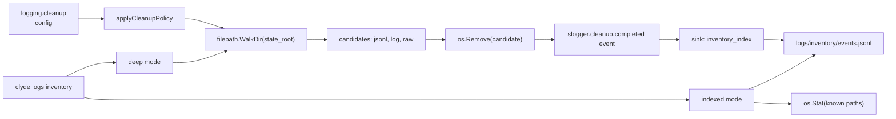

# Rotation And Cleanup

Clyde keeps file rotation and cleanup separate.

Rotation controls active log files. It applies max file size, max backups, max age, and compression policy through `internal/slogger`.

Cleanup controls stale files. It is enabled by `logging.cleanup.enabled` and uses retention settings to remove aged rotated files, aged sidecars, empty artifacts, and files that exceed total budget rules.

When cleanup is disabled, Clyde may audit eligible files, but it should not delete them.

Cleanup applies across the logging surfaces exposed by inventory:

- Process logs.
- Concern logs.
- Per-chat logs.
- MITM capture indexes.
- MITM raw sidecars.
- Provider sidecars.
- LaunchAgent fallback logs.

Use `clyde logs inventory --deep --json` around manual cleanup when exact file counts matter.

## Cleanup and inventory wiring

The cleanup pass emits `slogger.cleanup.completed` with `scanned_roots`, `candidates`, `deleted`, `bytes_deleted`, `skipped`, `errors`, and `duration_ms`. The event flows through the inventory sink to `logs/inventory/events.jsonl`, which `clyde logs inventory` reads in indexed mode to surface the most recent cleanup result per sink. Deep mode stays off that snapshot path and reports only filesystem-derived totals.
