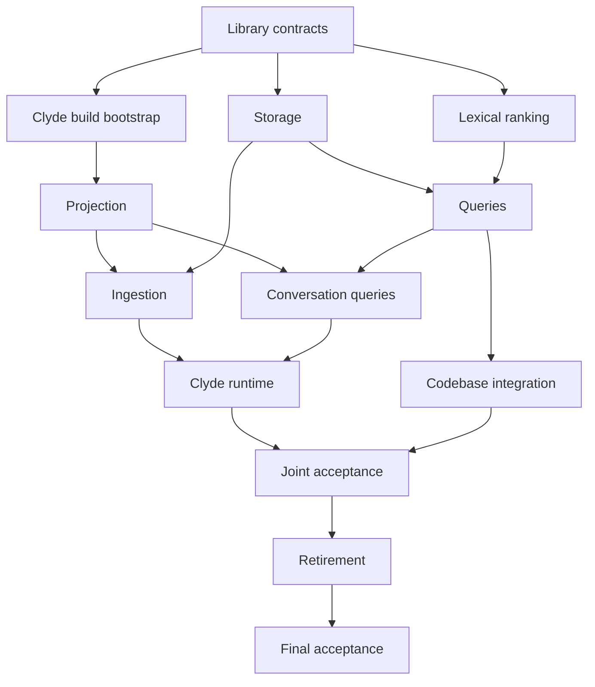

# Coordinate the shared search implementation

## Goal

Complete LMS-708, LMS-648, and CLYDE-758 through independent implementation lanes and joint validation. Clyde uses the generic library with its own Milvus connection. Both applications use canonical vector storage for new writes.

This is the sole coordination plan. Component plans provide exact implementation steps. Specifications provide behavior and interface contracts. Tickets track status and link to these documents.

## Current behavior

The planning branches contain specifications. Clyde still calls the existing LMS daemon client. LMS stores vectors on source rows and in its reuse catalog. Runtime implementation and acceptance remain pending.

The planning bases are LMS `d2c763db23271bb28d17ec4198da843b5d6c67df` and Clyde `3860a8c4ed843fcf52592b0aa558849522f9d25f`. Refresh repository and deployed revisions before implementation.

## Use one source for each contract

| Concern | Authoritative source |
| --- | --- |
| Generic API, storage, publication, filters, ranking, and cursors | Read the [LMS specification](https://github.com/agoodkind/lm-semantic-search/blob/docs/shared-search-library/docs/superpowers/specs/2026-09-27-shared-search-library-design.md). |
| Conversation selection, retention, metadata, configuration, and errors | Read the [Clyde specification](../specs/2026-09-27-embedded-search-design.md). |
| Execution order, ownership, integration, acceptance, and status | Use this coordination plan. |
| Component edits and verification | Execute the linked lane plans below. |

Change the authoritative source and its affected component plan together when resolving a contradiction. Do not create new requirements from historical plans or ticket comments.

## Constraints

1. Re-read both specifications before starting a lane, at each task boundary, after compaction, and before integration. Check comments, tests, documents, tickets, and status updates against the prose rules at each task boundary.
2. Use subagent-driven development for independent work. Assign exact files and prerequisite revisions. Review each implementation against its specification before integration.
3. Run implementation tests against isolated stores and immutable artifact snapshots. Do not change production services, provider artifacts, or the existing research experiment.
4. Require real dependencies at public test boundaries. Fail acceptance when dependencies are unavailable, required tests skip, or no test matches.
5. Append conversation occurrences without deletion. Do not add message editing or edit-history work. Codebase retention remains independently configurable.
6. Continue restore and corpus research under LMS-707, LMS-709, LMS-710, and CLYDE-759. A repaired production corpus is not a development prerequisite.
7. Complete LMS conversation subsystem removal within this work. Production cutover and the conditional one-time reset require measured migration evidence.

## Execute the dependency graph

Development prerequisites supply interfaces and code. Acceptance prerequisites supply the running integration.

| Lane and plan | Development prerequisites | Acceptance prerequisites | Assigned files and interfaces |
| --- | --- | --- | --- |
| [L0: Library contracts](https://github.com/agoodkind/lm-semantic-search/blob/docs/shared-search-library/docs/superpowers/plans/2026-09-27-shared-search-l0-contracts.md) | Start from the LMS base. | The public package compiles with native dependencies outside the application. | Assign exported types, preparation, and initial build targets. |
| [L1: Storage and recovery](https://github.com/agoodkind/lm-semantic-search/blob/docs/shared-search-library/docs/superpowers/plans/2026-09-27-shared-search-l1-storage.md) | L0 supplies the API. | Real storage and restart tests pass. | Assign catalog, outbox, adapters, and shared library test harness. |
| [L2: Lexical ranking](https://github.com/agoodkind/lm-semantic-search/blob/docs/shared-search-library/docs/superpowers/plans/2026-09-27-shared-search-l2-lexical.md) | L0 supplies the API. Develop alongside L1. | Integrate L1's catalog and L3's public search before score acceptance. | Assign lexical migration, analyzer, postings, and tests. |
| [L3: Query execution](https://github.com/agoodkind/lm-semantic-search/blob/docs/shared-search-library/docs/superpowers/plans/2026-09-27-shared-search-l3-query.md) | Integrate L1 and L2. | Complete-result and cursor tests pass. | Assign filters, scoring, rank fusion, snapshots, and tests. |
| [C4.1: Clyde build bootstrap](2026-09-27-embedded-conversation-runtime.md) | L0 supplies an importable revision. | Clyde compiles with pinned native sources. | Assign module files, build wiring, and initial test targets. |
| [C1: Conversation projection](2026-09-27-embedded-conversation-projection.md) | L0 and C4.1 supply the build contract. | C4 runtime enables public application tests. | Assign projection, stable IDs, tool text, filters, and projection tests. |
| [C2: Conversation ingestion](2026-09-27-embedded-conversation-ingestion.md) | C1 and L1 supply rows and persistence. | C4 runtime enables public restart and unchanged-pass tests. | Assign workers, checkpoints, outbox, and ingestion tests. |
| [C3: Conversation queries](2026-09-27-embedded-conversation-query.md) | C1 and L3 supply filters and retrieval. | C4 runtime enables CLI and MCP tests. | Assign query adapters, cursor/context fields, and query tests. |
| [L4: Codebase integration](https://github.com/agoodkind/lm-semantic-search/blob/docs/shared-search-library/docs/superpowers/plans/2026-09-27-shared-search-l4-codebase.md) | L1 and L3 supply persistence and retrieval. | Codebase and offline acceptance pass. | Assign LMS application integration and codebase tests. |
| C4.2 and later runtime tasks | Integrate C2 and C3. | Joint acceptance below passes. | Assign lifecycle, configuration, public harness, and measurement command. |
| [L5: Conversation retirement](https://github.com/agoodkind/lm-semantic-search/blob/docs/shared-search-library/docs/superpowers/plans/2026-09-27-shared-search-l5-retirement.md) | L4 and C4 pass joint acceptance. | Both applications pass with the removal candidate. | Assign obsolete code, protobuf removal, and regeneration. |



Complete C4.1 before C1 in one Clyde foundation PR. Integrate C4's later runtime tasks with C3 after C2. Do not enable the new backend in the foundation PR.

Assign separate schema files to L1 and L2 and separate test files to C1, C2, and C3. Assign initial LMS Makefile changes to L0 and Clyde Makefile changes to C4. Transfer ownership explicitly before editing another lane's files.

## Assign agent slices and pull requests

Assign one implementation agent to each ticket and PR. An agent may delegate independent files within its slice under the subagent-driven development rule. Keep behavior, generated output, and public tests in the same PR. No implementation PR exists yet.

| Ticket and proposed PR title | Agent scope | Git parent while the prerequisite PR is open | Acceptance boundary |
| --- | --- | --- | --- |
| LMS-711: `[LMS-711] Publish shared search contracts and canonical storage` | The LMS storage agent implements L0 and L1. | `origin/main` | The public module imports; canonical storage, replay, and strict live tests pass. |
| LMS-712: `[LMS-712] Implement occurrence ranking and complete search pages` | The LMS search agent implements L2 and L3. | LMS-711 branch | Occurrence-weighted ranking and public complete-page tests pass together. |
| LMS-713: `[LMS-713] Adopt shared storage for codebase and offline search` | The LMS codebase agent implements L4. | LMS-712 branch | Codebase replacement, deletion, and offline profile pass. |
| LMS-714: `[LMS-714] Remove the obsolete LMS conversation subsystem` | The LMS retirement agent implements L5 after joint acceptance. | LMS-713 branch | Regenerated protocol, LMS codebase behavior, and Clyde's pinned removal revision pass. |
| CLYDE-760: `[CLYDE-760] Add native library build and conversation projection` | The Clyde projection agent implements C4.1 and C1. | `origin/main` | Native imports and selected nonempty projection pass without enabling the new backend. |
| CLYDE-762: `[CLYDE-762] Append and recover conversation ingestion` | The Clyde ingestion agent implements C2. | CLYDE-760 branch | Real Milvus and SQLite recovery tests pass with immutable occurrences. |
| CLYDE-761: `[CLYDE-761] Expose complete search and validate the runtime` | The Clyde search agent implements C3 and C4.2. | CLYDE-762 branch | CLI and MCP tests, daemon restart, and full-corpus acceptance pass with LMS-713. |

Use Graphite through its MCP interface for each repository's dependent PR chain while parent PRs remain open. Base a later independent PR on refreshed `origin/main` when its prerequisite has merged. Cross-repository dependencies use exact LMS module revisions and ticket links, never a Graphite parent. LMS-711 first publishes L0's importable contract. L2 development can then proceed alongside L1 in disjoint files; LMS-712 integrates L2 with L3 after LMS-711 passes its storage gate. CLYDE-760 can start native preparation during LMS-711 and pin the reviewed library revision before completing projection.

## Tasks

### 1. Record bases and assign branches

Files:

- Update the execution table in this document.

Behavior:

- Each worker uses one isolated checkout and recorded dependency revisions.
- The coordinator alone edits execution status.

Steps:

1. Run `git fetch origin`, `git status --short`, `git worktree list --porcelain`, and `git rev-parse origin/main` in each repository. Record bases and dirty paths. Preserve uncommitted work on the stopped `port-production-search` branch.
2. Complete the L0 contract within LMS-711 first. Develop L1, L2, and C4.1 in disjoint files afterward. Integrate L2 with L3 in LMS-712 after LMS-711 passes. Complete C1 with C4.1 in CLYDE-760. Start C2 and C3 when their listed development prerequisites exist.
3. Use the PR parent map above while parent PRs remain open. Use Graphite for real unmerged dependencies within one repository. Cross-repository dependencies use exact module revisions, not Graphite parentage.
4. Record each worker's files, dependency commits, and required validation before assignment. Keep C4.1 with C1 and later runtime integration with C3 in separate PRs.
5. Inspect existing unfinished code before reuse. Do not duplicate a source implementation to avoid a dependency.

Verification:

- Run: `git status --short` and `git worktree list --porcelain`.
- Expect: Every active lane has one worker, checkout, dependency revision set, and disjoint write paths.

### 2. Integrate component changes

Files:

- Modify only the assigned lane files.
- Update this document's execution table.

Behavior:

- Component development can finish before application acceptance.
- Enable the new application backend only after complete integration passes.

Steps:

1. Execute L0 and L1 checks. Integrate L2's lexical implementation with L1, then implement L3's public query path. Run L2 and L3 acceptance against that combined revision.
2. Run the strict LMS targets declared by L0: `make library-live-l1`, `make library-live-l2`, `make library-live-l3`, and `make library-live-l4`. Each target must fail on missing dependencies, skipped required tests, and zero matched tests.
3. Integrate C1, C2, and C3 into C4's runtime branch. Run `make embedded-search-live` after C4 creates the target. Verify CLI and MCP operations without an LMS daemon.
4. Run `make test` and `make check` in both repositories. Run `make offline-live` in LMS. Use each lane's native prerequisites before direct Go commands.
5. Read the active base-branch GitHub ruleset for every PR. Resolve review threads, approvals, conflicts, and required checks through babysit. Use Graphite MCP for dependent stack operations and verify signatures after history rewrites.

Verification:

- Run: The component targets and repository gates above at exact integrated revisions.
- Expect: Each required test executes successfully. Save test names, dependency identities, exit codes, and evidence paths in the execution table.

### 3. Measure joint acceptance

Files:

- Use the full-corpus harness created by C4.
- Update the execution table with report paths and checksums.

Behavior:

- Evaluate result completeness against source-derived expected occurrences and an exhaustive oracle.
- Compare speed and memory with a matched healthy baseline. A damaged restored corpus is not a healthy reference.

Steps:

1. Freeze an immutable source snapshot and query battery before tuning. Include recovered useful queries, paging regressions, excluded high-ranked matches, shared vectors, repeated content, ties, group saturation, missing artifacts, and more than 16,384 distinct eligible vectors.
2. Record corpus, query, model, hardware, limits, and concurrency identities in both reports. Require verified expected results in the baseline. Record missing baseline evidence as an acceptance blocker without stopping independent implementation.
3. Schedule heavy measurements with the research agent. Do not change its production-ingestion pause or services.
4. Create a baseline report with C4's `make shared-search-baseline` command using the verified existing binary and isolated stores. Set the candidate command inputs below to absolute paths for the recorded snapshot, battery, healthy baseline, and output report. Run the command from Clyde after C4 creates it.
5. Inspect failed cases, fix the responsible component, and repeat the frozen battery before acceptance.
6. Measure 16 GB and 24 GB configurations with exact limits. Report Clyde, model, Milvus, and total workload RSS separately.
7. Measure initial indexing by source reading, selection, embedding, persistence, and searchable completion. Estimate total work from selected nonempty content only. Label estimates and measure a second unchanged pass.

```bash
make shared-search-acceptance \
    CORPUS_SNAPSHOT="$CORPUS_SNAPSHOT" \
    QUERY_BATTERY="$QUERY_BATTERY" \
    BASELINE_REPORT="$BASELINE_REPORT" \
    REPORT_PATH="$REPORT_PATH"
```

Verification:

- Expect: Every eligible occurrence appears once in the complete traversal. Pages fill until the filtered result ends. Cursor order remains stable across concurrent writes.
- Expect: Compatible duplicate content adds no canonical vector. An unchanged second pass performs zero embedding requests and zero vector writes.
- Expect: No latency or memory regression against the matched healthy workload. Report cold startup, first and later pages, full traversal, p50, p95, maximum, peak/steady RSS, temporary disk, and compacted backend bytes.
- Reject candidate cutoffs, partial successful pages, and weakened query batteries. Optimize under the same correctness oracle when measurements fail.

### 4. Retire the conversation subsystem

Files:

- Execute L5's removal map.
- Update this document's execution table and affected operational documentation.

Behavior:

- Both applications use the library revision that removes conversation-specific LMS code.
- Existing legacy collections remain readable until a separately authorized migration or retirement.

Steps:

1. Record passing L4 and C4 revisions and their joint acceptance report. Build the L5 removal candidate.
2. Pin Clyde to the exact candidate. Run `make library-live-l5` and `make offline-live` in LMS. Run `make embedded-search-live` and the frozen acceptance command in Clyde.
3. Run repository gates on the final revisions. Verify regenerated protocol sources and bindings agree and removed handlers have no runtime callers.
4. Prepare the current-corpus migration decision from source coverage, unavailable artifacts, compatible vectors, disk needs, rebuild time, and search measurements. Do not turn the conditional reset option into a mandatory reset.
5. Record review, checks, merge, deployment, and live validation separately. Stop after authorized integration and validation. Do not transfer the task to another agent automatically.

Verification:

- Expect: LMS contains no conversation RPC or conversation-specific runtime. Clyde ingestion, queries, restart, and context pass. Codebase lifecycle and offline search pass.
- Expect: Any production change has separate authorization and deployment evidence.

## Track execution

Only the coordinator edits this table. Add each branch/PR, exact commit, dependency commits, command, exit code, and report path when execution begins. Update the row after each meaningful change. Record system/configuration mutations and restoration in the affected row.

| Lane | Status | Required dependency |
| --- | --- | --- |
| L0 | Implementation has not started under this plan. | Use the recorded LMS base. |
| L1 | Implementation has not started under this plan. | Complete L0. |
| L2 | Implementation has not started under this plan. | Complete L0; integrate L1 and L3 for public search acceptance. |
| L3 | Implementation has not started under this plan. | Integrate L1 and L2. |
| C4.1 | Implementation has not started under this plan. | Complete L0. |
| C1 | Implementation has not started under this plan. | Complete L0 and C4.1. |
| C2 | Implementation has not started under this plan. | Complete C1 and L1. |
| C3 | Implementation has not started under this plan. | Complete C1 and L3. |
| L4 | Implementation has not started under this plan. | Complete L1 and L3. |
| C4 runtime | Implementation has not started under this plan. | Integrate C2 and C3. |
| Joint acceptance | Runtime measurements remain pending. | Integrate C4 and L4; establish a healthy baseline. |
| L5 | Implementation has not started under this plan. | Pass joint acceptance. |
| Production migration | The research decision remains open. | Evaluate LMS-709 and CLYDE-759 evidence. |

## Reconcile superseded work

Older pages contain short supersession records. Git history preserves previous text. Do not execute historical instructions.

| Previous work | Current disposition |
| --- | --- |
| September 26 generic LMS ingestion, search, and retirement plans | Execute L0 through L5 instead. LMS-15 and LMS-17 remain completed history. |
| September 26 Clyde ingestion and search cutovers | Execute C1 through C4 instead. CLYDE-629 and CLYDE-643 remain cancelled. |
| September 26 coordination plan | Execute this plan instead. |
| September 22 local-search design and September 26 local-search plan | Use the current Clyde specification and component plans. Source selection, public behavior, and corpus measurements remain required. |
| September 27 LMS and Clyde umbrella plans | Execute the independent component plans instead of the old combined task bodies. |
| July 29 tool embedding plan and specification | Use Clyde projection requirements for display text, language hints, raw fallback, UTF-8, token deduplication, and tool attribution on every part. Retire old conversation replacement instructions. |
| LMS-10, LMS-11, LMS-16, LMS-18, and LMS-19 | The cancelled RPC work is superseded by LMS-708. |
| CLYDE-750 through CLYDE-756 | CLYDE-758 replaces the obsolete dual-backend, bundled-model, RAM-index, and RPC-dependent architecture. Execute retained acceptance requirements through the current component plans. |
| LMS-648 | Implement generic deduplication through L1, L3, L4, and joint acceptance. Legacy backfill remains separate. |
| LMS-707, LMS-709, LMS-710, and CLYDE-759 | Continue research and record evidence independently from refactor completion. |

Preserve unrelated scheduling, daemon lifecycle, and provider contracts. Update their documentation only when the assigned implementation changes their behavior.
