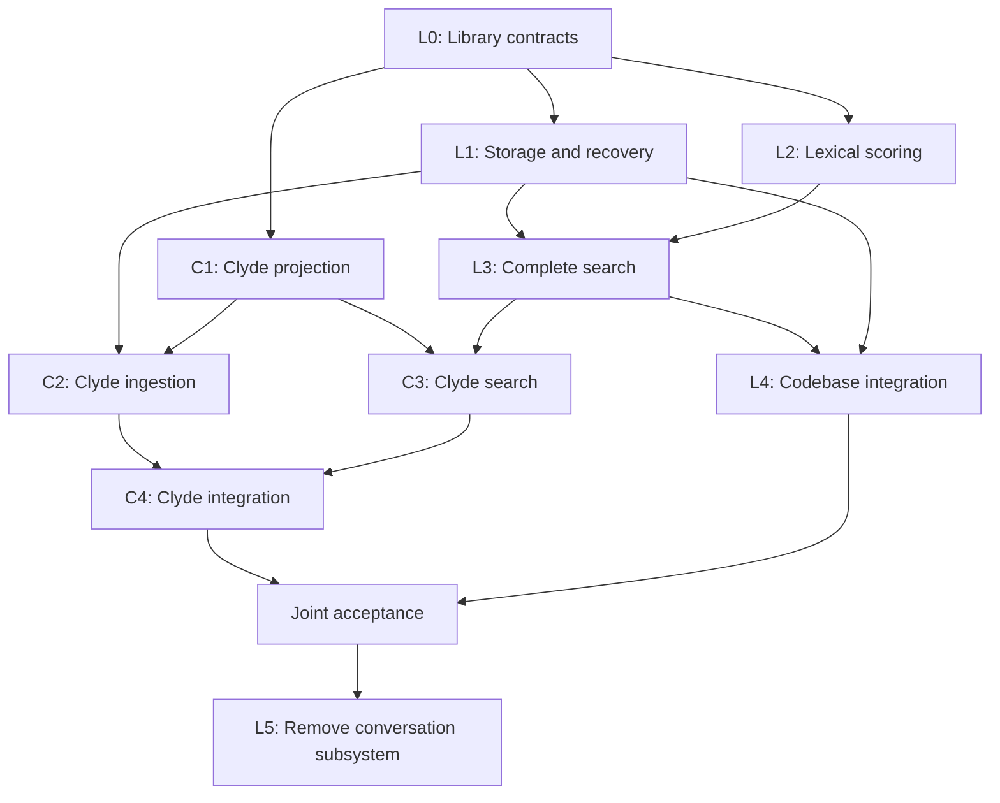

# Coordinate the shared search library implementation

## Goal

Implement LMS-708, LMS-648, and CLYDE-758 as separate, reviewable changes. Clyde must index and search conversations through the shared library with its own Milvus connection. Both applications must use the shared deduplication implementation for new writes. Complete this plan through validated integration before declaring the refactor ready for release.

This document defines implementation order and ownership. It does not report completed implementation or authorize a production reset.

## Use the selected contracts

The [LMS library specification](https://github.com/agoodkind/lm-semantic-search/blob/6b92ad6cb1855180a2d0928938a7ecf29aac2084/docs/superpowers/specs/2026-09-27-shared-search-library-design.md) defines generic storage, publication, filtering, scoring, and paging. The [Clyde specification](../specs/2026-09-27-embedded-search-design.md) defines conversation projection, retention, configuration, and result interpretation. Use those contracts instead of the superseded RPC cutovers.

Execute exact file changes and component tests from the [LMS implementation plan](https://github.com/agoodkind/lm-semantic-search/blob/6b92ad6cb1855180a2d0928938a7ecf29aac2084/docs/superpowers/plans/2026-09-27-shared-search-library.md) and [Clyde implementation plan](2026-09-27-embedded-conversation-search.md).

## Establish the starting state

1. Fetch both repositories. Record each implementation branch base from `origin/main`, the deployed binary revisions, the Milvus version, and the research corpus identity.
2. Inspect the stopped `port-production-search` branch before reusing any implementation. Preserve its uncommitted work. Adopt only changes that satisfy the new contracts.
3. Keep LMS-707, LMS-709, LMS-710, and CLYDE-759 active as research work. Record their evidence independently from refactor progress. The restore diagnosis and current-corpus reset decision do not block library or projection development.
4. Coordinate resource-heavy validation with the existing clean-install experiment. Do not restart its services, change its ingestion settings, or count a contended timing run as an uncontended measurement.

## Assign separate ownership

Each lane owns its files until integration. Add lane-specific files for independent work. Assign edits to shared constructors, module files, configuration entrypoints, and generated code to the integration owner indicated below.

| Lane | Owner responsibility | Development dependency | Integration requirement |
| --- | --- | --- | --- |
| L0 | Define the public library API, build contract, and shared error/configuration types. | Start from the LMS base. | Publish an importable, pinned contract before consumer branches compile against it. |
| L1 | Implement the transactional occurrence catalog, vector identity, writer coordination, publication, and recovery. | Use L0. | Pass real concurrent-process and interrupted-write tests. |
| L2 | Implement lexical postings and occurrence-weighted scoring. | Use L0. Develop alongside L1. | Compare scores and global ordering with the real Milvus parity corpus. |
| L3 | Implement complete filtered search, global ranks, result snapshots, and paging. | Use L0. Integrate L1 and L2 before query acceptance. | Pass every complete-page and filter oracle case. |
| C1 | Implement Clyde projection, stable occurrence identity, and typed metadata/filter preparation. | Use L0. Develop alongside L1 and L2. | Preserve the existing content and provider extension contracts. |
| C2 | Implement Clyde incremental ingestion and committed checkpoints. | Use C1 and L1. | Prove unchanged ingestion performs no embedding or vector writes. |
| C3 | Implement Clyde search, occurrence hydration, and context revision handling. | Use C1 and L3. | Prove CLI and MCP results with the LMS daemon absent. |
| L4 | Integrate the library into codebase indexing and search. | Use L1 and L3. | Preserve codebase lifecycle behavior and verify new writes share vectors. |
| C4 | Integrate Clyde configuration, native dependencies, connection lifecycle, reload, and daemon wiring. | Use C2 and C3. | Pass Clyde integration and full-corpus acceptance. |
| L5 | Remove the LMS conversation subsystem and retired protocol. | Verify C4 against the removal candidate and retain L4 coverage. | Prove both applications work with the removal commit. |

L0 owns public type files and initial module/build wiring. L1 owns generic store migrations. L2 owns lexical implementation files. L3 owns query and cursor implementation files. L4 owns LMS application wiring. C4 owns Clyde daemon/configuration composition and dependency pins. L5 owns LMS protobuf edits and regeneration. The component plans assign the remaining exact files.

## Create reviewable branches

1. Create independent branches from the recorded remote base when a lane has no unmerged code dependency. Create a dependent Graphite branch only when its code requires an unmerged ancestor in the same repository.
2. Develop L1, L2, and C1 concurrently after L0. Keep L1 and L2 as sibling branches; merge or integrate their completed prerequisites before finalizing L3. Graphite parentage represents one Git ancestry chain, not every logical dependency in the table.
3. Link cross-repository PRs explicitly. Pin Clyde to the exact reviewed LMS revision. Do not model a cross-repository dependency as a Graphite parent.
4. Use Graphite MCP for dependent branch creation, submission, restacking, and merging. Fetch before comparisons. Never move the trunk ref from a feature worktree when another checkout owns trunk. Verify signed commits after every history rewrite.
5. Include observable behavior and its real public-boundary coverage in the same PR. Do not merge an enabled partial backend. Foundations may compile and merge before application activation.
6. Run the full babysit workflow for every open PR, including the active base-branch ruleset, required checks, approvals, and review-thread resolution. Passing CI alone does not prove merge readiness.

## Validate the shared contract

1. Run the library public API against an isolated real Milvus instance and a real SQLite catalog. Use the production embedding adapter with an isolated compatible model endpoint. Do not substitute mocks, recorded responses, or a second implementation of production filtering.
2. Ingest repeated content from a conversation namespace and a code namespace under a compatible model identity. Verify one canonical live vector and every occurrence. Change the model identity and verify a separate vector.
3. Run simultaneous writers from separate processes. Kill a writer at each publication boundary. Restart it and verify durable occurrences, correct checkpoints, and idempotent replay. Measure transient backend versions separately from canonical live-vector counts.
4. Search a corpus containing more than 16,384 distinct vectors. Include excluded and included occurrences sharing vectors, heavily repeated content, restrictive filters, tied scores, absent lexical terms, group limits, and concurrent ingestion. Compare every page against the exhaustive reference result.
5. Check BM25 statistics and reciprocal rank fusion against occurrence-based reference data. Do not accept unchanged result counts as proof of unchanged scoring. Compare identities, order, modality scores, and final scores.
6. Verify bounded process memory and temporary-disk accounting under the configured limits. Exhaustion, timeout, corruption, and missing-vector conditions must return typed errors rather than successful partial results.
7. Run both application suites against the same library revision. Remove the LMS daemon from the Clyde test environment. Verify Clyde ingestion, search, restart, and context interpretation without it. Keep LMS code-search daemon tests separate.

Use existing `make test` and `make check` gates in each repository after the documented native dependency bootstrap. Use the component plans for opt-in live commands. Treat a skipped real-dependency suite as missing evidence. Do not start or deploy a second unmanaged daemon against operator state.

## Measure release acceptance

1. Freeze the query battery before tuning. Recover previously useful queries from Clyde conversation history and add the known recall, paging, and restore regressions. Record expected occurrence IDs from source artifacts and the exhaustive reference.
2. Measure the candidate and a recovered healthy baseline on the same corpus, hardware, query battery, and concurrency. Separate cold startup, collection loading, warm first-page latency, later-page latency, and full traversal. Report p50, p95, maximum latency, peak RSS for each process, Milvus RSS, and temporary disk use.
3. Require complete eligible results and stable page traversal in the oracle cases. Reject fixed candidate truncation, successful partial results, and post-ranking eligibility removal.
4. Require no measured latency or memory regression against the matched healthy baseline before release. A baseline with the known restore or paging defect is not a passing reference. If a healthy comparison cannot be reproduced, record that missing measurement; do not invent an accepted numeric budget or claim performance acceptance.
5. Measure first indexing time, compatible-vector reuse, model requests, selected nonempty rows, source coverage, logical vector bytes, backend physical bytes, and metadata bytes. Run a second unchanged pass and verify zero embedding work and zero vector writes.
6. Include constrained-memory execution in the recovered 16 GB and 24 GB acceptance environments. Record the exact imposed limits and model dimensions. Do not load every source transcript or vector into the application heap merely to pass a query.
7. Optimize the exact executor if measurements fail. Require each optimization to pass the same result oracle and resource measurements. Do not replace the requirements with a latency/completeness tradeoff.

## Complete integration and retirement

1. Decide the current-corpus migration from the research evidence. Compare reuse/import with the conditionally permitted one-time reset. Record source coverage, unavailable artifacts, expected rebuild time, and required disk space. Preserve the forward retention contract after either choice.
2. Verify the new codebase path writes shared vectors without changing codebase retention rules. Keep existing legacy collections intact until an explicit migration or retirement action. Do not count deployment as backfilling old duplicates.
3. Validate the Clyde candidate against the LMS removal candidate before deleting the conversation subsystem. Remove obsolete RPCs, adapters, schemas, conversion, configuration, tests, dependencies, and documentation within this work.
4. Re-run both applications' public acceptance checks against the final revisions. Record checks, review resolution, merge state, deployment state, and live validation separately.
5. Stop when the implementation is reviewed, green, and validated in the authorized environment. Report the exact revisions and remaining release state. Do not start another agent or transfer responsibility automatically.

## Preserve the implementation record

1. Keep one shared progress ledger associated with LMS-708 and CLYDE-758. Record each lane's branch, PR, immutable revision, dependency revision, validation command, result, and blocker.
2. Update the ledger after every meaningful state change. Record system/configuration changes and restore their intended state after experiments. Do not treat a chat update as a substitute for the ledger.
3. Re-read both specifications before starting a lane, after compaction, before integration, and whenever a requirement conflict appears. Correct contradictory comments, tests, documentation, and status prose as part of the affected lane.
4. Keep cancelled RPC tickets cancelled. Reuse completed generic work where it satisfies the library contract. Do not resume a superseded plan from an old goal or remembered context.
