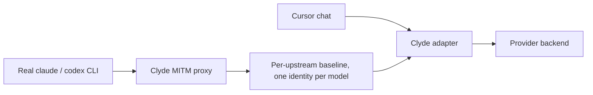

# Wire baseline

When Cursor (or any Agent chat interface) sends a chat through Clyde's OpenAI Chat Completions Endpoint, the request has to leave us looking exactly like the real native client the provider expects. If our outbound request does not match their expecte shape, they can reject it outright, bill it against the wrong plan, or miss the prompt cache and make every turn slower and more expensive. So Clyde learns what the provider client puts on the wire and replays it.

We never hand-write that wire shape, we learn it from the genuine article. When you run real `claude` or `codex` through Clyde's MITM proxy (see [Cursor](cursor.md) for how that traffic is routed), the proxy watches each request and records its shape, the headers, the beta flags, and the body field set, with secrets stripped and no prompt text kept. That recording becomes a per-upstream baseline, one learned identity per model, and it keeps itself current as the real clients change. There is nothing to configure and no snapshot to maintain by hand.

## One identity per model

The catch is that the right wire identity is not the same for every model. The provider sends different flags for different models, and some of those flags depend on your account.

When a Cursor request comes in, we apply the identity learned for that exact model, which means the flags we set on the request is the one the provider client itself would send for that model on your account. Put the wrong model's identity on a request and the backend rejects it, because you have just claimed a capability your account does not hold for that model.

A model Clyde has never seen has no identity to replay, so the request fails with a clear 503 that names the model. Seeding it is not a config edit, it is one ordinary session: run `claude` or `codex` once with that model through the MITM, and within about a minute the baseline has learned it and the model works.

## Stripping flags on purpose

Faithful replay is the default, but you can name capability flags to drop from the outbound request through the `strip_wire_flags` list in config. It is provider-neutral, so the same list applies to whichever capability header a given provider sends, and an empty list replays the learned identity untouched. The flag names are vendor-specific, so they live in your local config and never in the repo.

## What we cannot fake

If a provider computes a per-request attestation we cannot forge, for example the billing hash claude-code stamps into its first system block, or the attestation header codex sends. Clyde replays the last value it saw, which is honest but can go stale and get rejected on the next turn.

## Drift

A periodic check compares fresh captured traffic against the saved baseline and logs when they disagree. It is there to tell you the shape moved, nothing more, because the learner re-learns on its own and the live identity stays current without anyone touching it.

## Seeding by hand

The baseline normally learns itself from live traffic. When you already have a capture and want to seed from it directly, `clyde mitm baseline seed` reads that file and writes the baseline for the upstream.

Reference config can be found in the [config example](../clyde.example.toml).